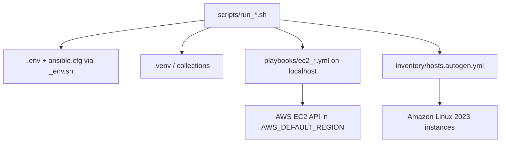
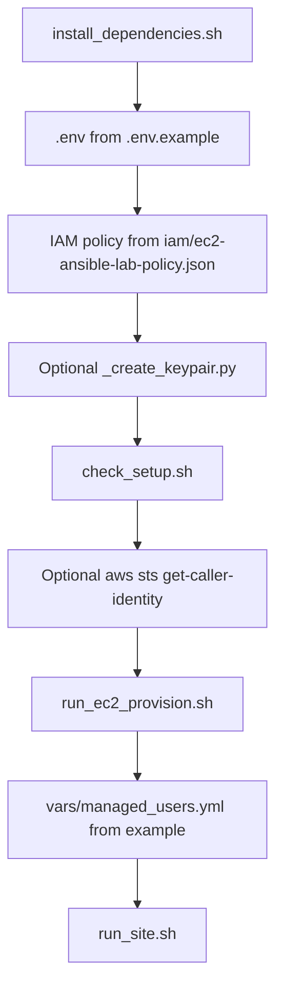
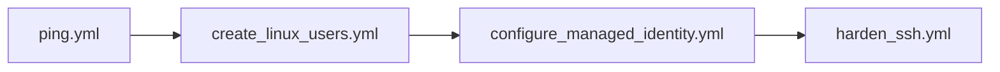
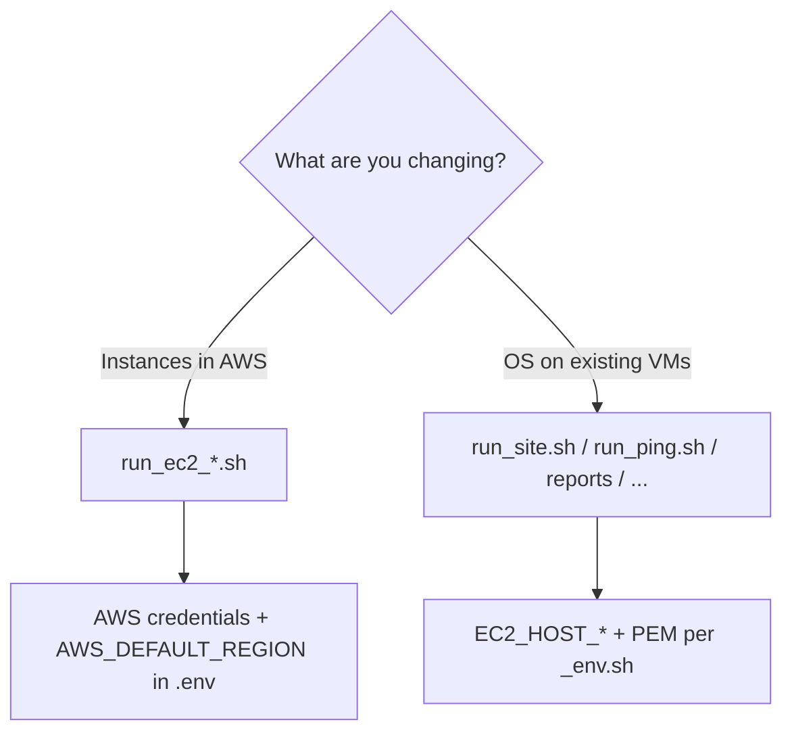

# Ansible EC2 Lab

| | |
|---|---|
| **Control node** | **apt-based** Linux (e.g. WSL). Bootstrap: **`scripts/install_dependencies.sh`**. |
| **Work type A** | **`playbooks/ec2_*.yml`** on **`localhost`** → **AWS EC2 API** in **`AWS_DEFAULT_REGION`**. |
| **Work type B** | Playbooks on inventory group **`linux`** → **SSH** to instances listed in **`inventory/hosts.autogen.yml`**. |
| **Secrets / generated files** | Listed in **`.gitignore`** (e.g. `.env`, `hosts.autogen.yml`, `vars/managed_users.yml`, `.keys/`, `reports/*.txt`, `reports/*.html`, `.venv/`). |

---

## Table of Contents

1. [Purpose and scope](#purpose-and-scope)
2. [Document conventions](#document-conventions)
3. [Diagrams](#diagrams)
4. [What this does](#what-this-does)
5. [Prerequisites](#prerequisites)
6. [Quick start](#quick-start)
7. [Repository structure](#repository-structure)
8. [Configuration reference (.env)](#configuration-reference-env)
9. [Scripts and playbooks](#scripts-and-playbooks)
10. [Command reference](#command-reference)
11. [Lifecycle diagram](#lifecycle-diagram)
12. [AWS cost and free tier](#aws-cost-and-free-tier)
13. [PEM key file setup](#pem-key-file-setup)
14. [Reports](#reports)
15. [Troubleshooting](#troubleshooting)
16. [Quick reference block](#all-wsl-commands-quick-reference)
17. [Tech stack](#tech-stack)
18. [Using this repo on macOS](#using-this-repo-on-macos)

---

## Document conventions

| Topic | This README uses |
|---|---|
| **Example repo path** | **`/mnt/c/dev/ansible/ansible`** = Windows **`c:\dev\ansible\ansible`** mounted in WSL. Replace with your path. |
| **Working directory** | All `bash scripts/...` commands assume **current directory = repo root** (the directory that contains **`playbooks/`** and **`scripts/`**). |
| **Environment** | **`scripts/run_*.sh`** source **`scripts/_env.sh`**, which loads **`.env`** and sets **`ANSIBLE_CONFIG`** to this repo’s **`ansible.cfg`**. |
| **Extra Ansible flags** | Pass after the script name (example: **`bash scripts/run_site.sh --check`**). |

---

## Purpose and scope

**What this repository is for** (based only on files in this tree):

| Goal | How this repo addresses it |
|---|---|
| Create and tear down a small fleet of **Amazon Linux 2023** VMs in one AWS region | `playbooks/ec2_provision.yml`, `ec2_stop.yml`, `ec2_start.yml`, `ec2_terminate.yml`, `ec2_nuke.yml` and matching `scripts/run_ec2_*.sh` |
| Keep **public IPs and inventory** aligned after provision or start | Updates `EC2_HOST_*` in `.env` and runs `scripts/render_inventory_from_env.sh` (see `ec2_provision.yml`, `ec2_start.yml`) |
| Apply a **repeatable** SSH baseline: users, keys, sudo, SSH daemon settings | `playbooks/site.yml` (imports `ping.yml`, `create_linux_users.yml`, `configure_managed_identity.yml`, `harden_ssh.yml`) and role `roles/managed_user/` |
| Capture **point-in-time evidence** on instances without manual SSH | `playbooks/report_audit.yml`, `report_security.yml` → files under `reports/` |
| Reduce **idle compute** charges | `ec2_stop.yml` (EBS and other charges still follow AWS pricing) |
| **Clean up** lab instances vs a broader region cleanup per `ec2_nuke.yml` | `run_ec2_terminate.sh` vs `run_ec2_nuke.sh` (see playbook headers) |

**Not implemented in this tree**: application releases, containers, orchestration beyond these playbooks, multi-region design, and AWS services not touched by the YAML in `playbooks/`.

---

## Diagrams

### Control node, AWS API, and SSH targets



EC2 playbooks use **`amazon.aws`** modules against **AWS**. SSH playbooks use **`inventory/hosts.autogen.yml`** (group **`linux`**) and a PEM resolved by **`_pem_for_ssh`** in the wrappers that connect over SSH.

### First-time path (happy path)



### Order inside `site.yml`



### API wrappers vs SSH wrappers



---

## What this does

| Artifact | What it does (verify in the YAML) |
|---|---|
| **`playbooks/ec2_provision.yml`** | **1–4** instances; Amazon Linux **2023 x86_64** (AMI via **`amazon.aws.ec2_ami_info`**); **8 GiB gp2** root; **`EC2_INSTANCE_TYPE`**, **`EC2_INSTANCE_COUNT`**, **`AWS_DEFAULT_REGION`** from **`.env`**. |
| **`playbooks/site.yml`** | Imports in order: **`ping.yml`** → **`create_linux_users.yml`** → **`configure_managed_identity.yml`** → **`harden_ssh.yml`**. |
| **`playbooks/report_audit.yml`** | Writes **`reports/audit_*.txt`** (pattern in **`.gitignore`**). |
| **`playbooks/report_security.yml`** | Writes **`reports/security_*.txt`** (pattern in **`.gitignore`**). |
| **`playbooks/ec2_stop.yml` / `ec2_start.yml`** | Stop or start lab instances; **start** refreshes **`EC2_HOST_*`** and runs **`scripts/render_inventory_from_env.sh`**. |
| **`playbooks/ec2_terminate.yml`** | Terminates **Project=ansible-lab** instances; clears **`EC2_HOST_*`** in **`.env`** (see playbook). |
| **`playbooks/ec2_nuke.yml`** | Region **`AWS_DEFAULT_REGION`** only; scope = resources described in **that playbook’s header** (not full-account, not non-EC2 services listed as out of scope there). |

**`.env.example`** defaults: **`AWS_DEFAULT_REGION=us-east-1`**, **`EC2_INSTANCE_TYPE=t3.micro`**, **`EC2_INSTANCE_COUNT=2`**.

---

## Prerequisites

| Requirement | Source in this repo | Notes |
|---|---|---|
| WSL or Linux with **apt** | `scripts/install_dependencies.sh` | Script targets Debian/Ubuntu-style systems (`apt-get`). |
| `ansible-playbook` | Installed via **apt** `ansible` if missing | Same script. |
| Python 3 + `venv` | apt `python3-venv` if needed | Used to create `ansible/.venv`. |
| boto3, botocore, awscli | `scripts/bootstrap_aws.sh` → `.venv` | Invoked by `install_dependencies.sh`. |
| Ansible collections | `requirements.yml` | Version ranges are the `version:` keys in that file (not re-listed here). |
| AWS account + IAM | `iam/ec2-ansible-lab-policy.json` | Attach per your org’s process. |
| EC2 key pair | Console or `scripts/_create_keypair.py` | PEM path for SSH playbooks: `EC2_SSH_PRIVATE_KEY` or default `~/.ssh/ec2-keypair.pem` (see `.env.example`). |

**Preflight:**

```bash
bash scripts/check_setup.sh
```

---

## Quick start

### One-line flow (after setup)

| Order | Command | Purpose |
|:---:|:---|:---|
| 1 | `cd /mnt/c/dev/ansible/ansible` | Repo root (adjust path if needed). |
| 2 | `bash scripts/run_ec2_provision.sh` | **`ec2_provision.yml`**: VMs + **`.env`** IPs + inventory. |
| 3 | `bash scripts/run_site.sh` | **`site.yml`**: SSH baseline on group **`linux`**. |

### Setup sequence (first machine)

| Step | Action | Command or rule |
|:---:|:---|:---|
| **1** | Dependencies | `bash scripts/install_dependencies.sh` |
| **2** | Local config | `cp .env.example .env` then edit. Minimum keys: **`AWS_ACCESS_KEY_ID`**, **`AWS_SECRET_ACCESS_KEY`**, **`AWS_DEFAULT_REGION`**, **`EC2_KEY_PAIR_NAME`**, **`EC2_INSTANCE_COUNT`**, **`EC2_INSTANCE_TYPE`** (see **`.env.example`**). |
| **3** | IAM | Attach **`iam/ec2-ansible-lab-policy.json`** (inline JSON) or **`AmazonEC2FullAccess`**. |
| **4** | Key pair (optional helper) | `set -a && . .env && set +a` then `.venv/bin/python scripts/_create_keypair.py` — creates **`ansible-lab-key`**, writes **`~/.ssh/ansible-lab-key.pem`** when new (see script). |
| **5** | Preflight | `bash scripts/check_setup.sh` — **WARN** on empty **`EC2_HOST_*`** before first provision is expected. |
| **6** | Confirm AWS identity | `set -a && . .env && set +a` then `.venv/bin/aws sts get-caller-identity` — expect **`Account`**, **`Arn`**, **`UserId`**. |
| **7** | Provision | `bash scripts/run_ec2_provision.sh` |
| **8** | User definitions | `cp vars/managed_users.example.yml vars/managed_users.yml` and edit (required for user-related plays). |
| **9** | Configure hosts | `bash scripts/run_site.sh` (or **`run_create_users_wsl.sh`** for users only — see **Command reference**). |
| **10** | Optional checks | `bash scripts/run_ping.sh` · `bash scripts/run_audit.sh` · `bash scripts/run_security.sh` |
| **11** | Stop VMs | `bash scripts/run_ec2_stop.sh` — EBS charges follow **AWS** pricing. |

### If you change IPs in `.env` by hand

| Step | Command |
|:---|:---|
| Regenerate inventory | `bash scripts/render_inventory_from_env.sh` |
| Optional validate | `ansible-inventory -i inventory/hosts.autogen.yml --list` |

---

## Repository structure

```
ansible/
├── .env.example               # All configurable variables (copy to .env)
├── .env                       # Your local config — gitignored, never commit
├── .gitignore
├── ansible.cfg                # Ansible configuration (callbacks, SSH tuning, roles path)
├── requirements.yml           # Ansible collection pinned versions
├── README.md
│
├── playbooks/
│   ├── ping.yml               # Connectivity health check
│   ├── gather_facts.yml       # Collect and display system facts
│   ├── create_linux_users.yml # Bulk Linux user creation (uses managed_user role)
│   ├── configure_managed_identity.yml  # Per-host identity configuration
│   ├── harden_ssh.yml         # SSH daemon hardening (idempotent)
│   ├── site.yml               # Master orchestration (runs all the above)
│   ├── report_audit.yml       # System audit snapshot → reports/audit_*.txt
│   ├── report_security.yml    # Security compliance check → reports/security_*.txt
│   ├── ec2_status.yml         # Live EC2 instance status from AWS API
│   ├── ec2_provision.yml      # Provision EC2 (default instance type: t3.micro via .env)
│   ├── ec2_stop.yml           # Stop running instances
│   ├── ec2_start.yml          # Start stopped instances, refresh IPs
│   ├── ec2_terminate.yml      # Terminate ansible-lab instances (tagged)
│   └── ec2_nuke.yml           # Destructive cleanup in AWS_DEFAULT_REGION (see playbook header)
│
├── roles/
│   └── managed_user/          # Reusable role: create user, SSH keys, sudo
│       ├── defaults/main.yml
│       ├── tasks/
│       │   ├── main.yml
│       │   ├── create_user.yml
│       │   ├── ssh_keys.yml
│       │   ├── sudoers.yml
│       │   ├── fix_permissions.yml
│       │   └── verify.yml
│       └── meta/main.yml
│
├── inventory/
│   ├── hosts.autogen.yml      # Auto-generated from .env — gitignored
│   ├── hosts.SAMPLE.yml       # Example inventory (shows structure)
│   ├── group_vars/
│   │   ├── all.yml            # SSH connection settings for all hosts
│   │   └── linux.yml          # Linux-specific marker variable
│   └── host_vars/
│       ├── server1.yml        # Per-host overrides
│       ├── server2.yml
│       ├── server3.yml
│       └── client.yml
│
├── vars/
│   ├── managed_users.yml      # User definitions (gitignored — contains SSH pubkeys)
│   └── managed_users.example.yml  # Template for managed_users.yml
│
├── templates/
│   ├── audit_report.txt.j2    # Jinja2 template for audit report
│   └── security_report.txt.j2 # Jinja2 template for security report
│
├── scripts/
│   ├── _env.sh                # Shared helper: load .env, resolve PEM path
│   ├── check_setup.sh         # Pre-flight checker (numbered sections [1]–[10])
│   ├── install_dependencies.sh # apt + .venv + full requirements.yml (use first)
│   ├── bootstrap_aws.sh # .venv + galaxy (also invoked by install_dependencies)
│   ├── verify_syntax.sh       # syntax-check playbooks listed in that script
│   ├── render_inventory_from_env.sh  # Regenerate inventory/hosts.autogen.yml from .env
│   ├── run_ping.sh
│   ├── run_facts.sh
│   ├── run_site.sh
│   ├── run_audit.sh
│   ├── run_security.sh
│   ├── run_harden_ssh.sh
│   ├── run_create_users_wsl.sh
│   ├── run_configure_managed_identity.sh
│   ├── run_ec2_status.sh
│   ├── run_ec2_provision.sh
│   ├── run_ec2_stop.sh
│   ├── run_ec2_start.sh
│   ├── run_ec2_terminate.sh
│   ├── run_ec2_nuke.sh        # Runs ec2_nuke.yml; interactive confirmation (region from .env)
│   ├── run_terminate_duplicate_lab_slots.sh  # Optional: dedupe lab slots (dry-run / --apply)
│   ├── wsl-bootstrap.sh       # CRLF cleanup + galaxy + configure_managed_identity only
│   ├── verify_per_host_users.sh
│   ├── ensure_per_host_users.sh
│   ├── verify_appoperator_all_hosts.sh
│   └── ensure_appoperator_all_hosts.sh
│
├── iam/
│   └── ec2-ansible-lab-policy.json  # IAM policy JSON — attach to your IAM user for EC2 playbooks
│
├── reports/                   # Generated *.txt / *.html gitignored; .gitkeep keeps dir
│   └── .gitkeep
│
└── .vscode/
    └── tasks.json             # VSCode tasks for one-click execution
```

---

## Configuration reference (.env)

Copy `.env.example` to `.env`. Playbooks read these via `lookup('env', …)` or shell environment after `_env.sh` / scripts `set -a` / `. .env`. Playbooks still contain fixed tags, resource names, and logic; see each YAML file.

| Variable | Required | Default / fallback | Description |
|---|---|---|---|
| `EC2_HOST_SERVER1` | SSH playbooks | empty until provision/start | Public IPv4; written by `ec2_provision.yml` / `ec2_start.yml` |
| `EC2_HOST_SERVER2` | same | same | |
| `EC2_HOST_SERVER3` | same | same | |
| `EC2_HOST_CLIENT` | same | same | |
| `EC2_SSH_PRIVATE_KEY` | SSH playbooks | if empty: `~/.ssh/ec2-keypair.pem` (see `_env.sh`) | PEM path in WSL |
| `AWS_ACCESS_KEY_ID` | EC2 API playbooks if not using instance profile / shared credentials | empty in `.env.example` | |
| `AWS_SECRET_ACCESS_KEY` | same | empty | |
| `AWS_DEFAULT_REGION` | EC2 API playbooks | `us-east-1` in `.env.example` | Must match target region for `amazon.aws.*` modules |
| `EC2_KEY_PAIR_NAME` | `ec2_provision` | empty in `.env.example` | AWS key pair **name** (not path) |
| `EC2_INSTANCE_COUNT` | `ec2_provision` | `2` | Asserted **1–4** in `ec2_provision.yml` |
| `EC2_INSTANCE_TYPE` | `ec2_provision` | `t3.micro` | Passed to `amazon.aws.ec2_instance` |

For IAM, use **`iam/ec2-ansible-lab-policy.json`** as-is or as a template; it is the source of truth for allowed actions in this repo.

---

## Scripts and playbooks

| Topic | Where to look |
|---|---|
| **Every wrapper → playbook → when to use** | **[Command reference](#command-reference)** (single canonical table). |
| **Which playbooks exist** | **`playbooks/*.yml`** and the tree under **[Repository structure](#repository-structure)**. |

### Credential and connection mode

| Mode | Scripts | Inventory | Needs PEM | Needs **`AWS_*`** in `.env` for this run |
|:---|:---|:---|:---:|:---:|
| **EC2 API** | **`run_ec2_*.sh`** | **`localhost,`** (per script) | No | Yes |
| **SSH** | **`run_site.sh`**, **`run_ping.sh`**, **`run_facts.sh`**, **`run_audit.sh`**, **`run_security.sh`**, **`run_harden_ssh.sh`**, **`run_create_users_wsl.sh`**, **`run_configure_managed_identity.sh`** | **`inventory/hosts.autogen.yml`** | Yes ( **`_env.sh`** ) | No (only **`EC2_HOST_*`** must be set) |

### Destroy: `ec2_terminate` vs `ec2_nuke` (read headers in the YAML)

| | **`ec2_terminate.yml`** | **`ec2_nuke.yml`** |
|---|---|---|
| **Scope** | Instances tagged **`Project=ansible-lab`** | **All** EC2 instances in **`AWS_DEFAULT_REGION`** (per playbook header) |
| **EBS (detached)** | Not deleted by this playbook | Deleted per playbook |
| **Unassociated EIPs** | Not released per this playbook | Released per playbook |
| **Security groups** | Not deleted per this playbook | **`ManagedBy=ansible`** SGs per playbook |
| **Wrapper guard** | **`run_ec2_terminate.sh`**: 5 s pause | **`run_ec2_nuke.sh`**: preview + type **`yes`**; **`--check`** = dry-run |

### Optional helpers (not a full `site.yml`)

| Script | Role |
|---|---|
| **`verify_syntax.sh`** | **`--syntax-check`** only for paths **listed inside that file**. |
| **`wsl-bootstrap.sh`** | CRLF strip on **`scripts/*.sh`**, **`ansible-galaxy`**, then **`run_configure_managed_identity.sh`** only. |
| **`run_terminate_duplicate_lab_slots.sh`** | **`_terminate_duplicate_lab_slots.py`** — default dry-run; **`--apply`** mutates. |
| **`verify_per_host_users.sh` / `ensure_per_host_users.sh`** | SSH to **`EC2_HOST_*`**; **`ensure_*`** needs **`.keys/appoperator_ed25519.pub`**. |
| **`verify_appoperator_all_hosts.sh` / `ensure_appoperator_all_hosts.sh`** | SSH; **`ensure_*`** needs **`.keys/appoperator_ed25519.pub`**. |

**PowerShell** (path matches this repo on `C:`):

```text
wsl -e bash /mnt/c/dev/ansible/ansible/scripts/wsl-bootstrap.sh
```

---

## Command reference

Run from **repo root** after `cd`. Example path: **`/mnt/c/dev/ansible/ansible`**. Trailing args go to **`ansible-playbook`** (example: **`bash scripts/run_site.sh --check`**).

### Catalog

| Command | Playbook or target | When to use |
|:---|:---|:---|
| **`bash scripts/install_dependencies.sh`** | **`bootstrap_aws.sh`** after apt | First setup; broken **`.venv`** or collections |
| **`bash scripts/bootstrap_aws.sh`** | **`.venv`** + **`requirements.yml`** | Refresh Python AWS stack without full apt |
| **`bash scripts/check_setup.sh`** | Local checks | After **`.env`** / key changes |
| **`bash scripts/verify_syntax.sh`** | Paths **in that script** | After YAML edits |
| **`bash scripts/render_inventory_from_env.sh`** | Writes **`inventory/hosts.autogen.yml`** | Manual **`EC2_HOST_*`** edits; also called from **`ec2_provision.yml`** / **`ec2_start.yml`** and several **`run_*.sh`** |
| **`bash scripts/run_ping.sh`** | **`ping.yml`** | Reachability + **`uptime`** |
| **`bash scripts/run_facts.sh`** | **`gather_facts.yml`** | Hardware / network summary |
| **`bash scripts/run_site.sh`** | **`site.yml`** | Full SSH baseline |
| **`bash scripts/run_create_users_wsl.sh`** | Renders inventory then **`create_linux_users.yml`** | Users from **`vars/managed_users.yml`** only |
| **`bash scripts/run_configure_managed_identity.sh`** | **`configure_managed_identity.yml`** | Per-host identity only |
| **`bash scripts/run_harden_ssh.sh`** | **`harden_ssh.yml`** | **`sshd`** hardening only |
| **`bash scripts/run_audit.sh`** | **`report_audit.yml`** | **`reports/audit_*.txt`** |
| **`bash scripts/run_security.sh`** | **`report_security.yml`** | **`reports/security_*.txt`** |
| **`bash scripts/run_ec2_status.sh`** | **`ec2_status.yml`** | EC2 summary in region |
| **`bash scripts/run_ec2_provision.sh`** | **`ec2_provision.yml`** | Create / reconcile lab VMs |
| **`bash scripts/run_ec2_stop.sh`** | **`ec2_stop.yml`** | Stop lab instances |
| **`bash scripts/run_ec2_start.sh`** | **`ec2_start.yml`** | Start + refresh **`.env`** + inventory |
| **`bash scripts/run_ec2_terminate.sh`** | **`ec2_terminate.yml`** (**5 s** delay in script) | Terminate lab-tagged instances; playbook clears **`EC2_HOST_*`** in **`.env`** |
| **`bash scripts/run_ec2_nuke.sh`** | **`ec2_nuke.yml`** | Region cleanup per playbook; **`--check`** dry-run |
| **`bash scripts/run_terminate_duplicate_lab_slots.sh`** | Python helper | Duplicate slot IDs; **`--apply`** to execute |
| **`bash scripts/wsl-bootstrap.sh`** | Bootstrap + identity only | CRLF / quick identity |
| **`bash scripts/verify_per_host_users.sh`** | SSH script | Verify **`srv01ops`**-style users |
| **`bash scripts/ensure_per_host_users.sh`** | SSH script | Ensure per-host ops users |
| **`bash scripts/verify_appoperator_all_hosts.sh`** | SSH script | Inspect **`appoperator`** |
| **`bash scripts/ensure_appoperator_all_hosts.sh`** | SSH script | Ensure **`appoperator`** |

### Python helpers

| Command | What it does |
|---|---|
| **`.venv/bin/python scripts/_create_keypair.py`** | Creates AWS key pair **`ansible-lab-key`** in **`AWS_DEFAULT_REGION`**; writes **`~/.ssh/ansible-lab-key.pem`** if new (see script) |
| **`scripts/_terminate_duplicate_lab_slots.py`** | Invoked only via **`run_terminate_duplicate_lab_slots.sh`** |

### Optional checks (not wrappers in `scripts/`)

| Command | When |
|:---|:---|
| **`set -a && . .env && set +a && .venv/bin/aws sts get-caller-identity`** | After **`install_dependencies.sh`**; confirms credentials the CLI sees. |
| **`ansible-inventory -i inventory/hosts.autogen.yml --list`** | After **`render_inventory_from_env.sh`**; confirms inventory JSON. |

Example (repo root):

```bash
cd /mnt/c/dev/ansible/ansible
set -a && . .env && set +a
.venv/bin/aws sts get-caller-identity
ansible-inventory -i inventory/hosts.autogen.yml --list
```

---

## Lifecycle diagram

```
  [EC2 not yet provisioned]
          │
          ▼
  bash scripts/run_ec2_provision.sh
  (creates instances, updates .env IPs, renders inventory)
          │
          ▼
  bash scripts/run_site.sh
  (SSH config, users, hardening)
          │
          ├── bash scripts/run_audit.sh      → reports/audit_*.txt
          ├── bash scripts/run_security.sh   → reports/security_*.txt
          │
          ▼
  [Work complete — save cost]
  bash scripts/run_ec2_stop.sh
          │
          ▼
  [Come back later]
  bash scripts/run_ec2_start.sh
  (instances restart; .env + hosts.autogen.yml refreshed)
          │
          ▼
  [Lab finished]
  bash scripts/run_ec2_terminate.sh  ← removes lab instances only
       OR
  bash scripts/run_ec2_nuke.sh       ← ec2_nuke.yml: region AWS_DEFAULT_REGION only (see playbook)
```

---

## AWS cost and free tier

| Fact | Source in repo |
|:---|:---|
| This tree does **not** cap spend | No billing logic in playbooks beyond choosing type/count/volume in **`ec2_provision.yml`**. |
| Root volume size / type | **8 GiB gp2** per instance in **`ec2_provision.yml`**. |
| Instance shape / count | **`EC2_INSTANCE_TYPE`**, **`EC2_INSTANCE_COUNT`** in **`.env`**. |
| Free Tier / on-demand | Determined by **AWS** and your account; see **`.env.example`** comments and AWS docs. |
| Stopped instances | No EC2 **instance-hour** charge; **EBS** attached to volumes still bills until volumes are gone (AWS pricing). |
| **`ec2_nuke.yml`** scope | Only resources described in **that playbook** and region **`AWS_DEFAULT_REGION`** — not entire account; not services outside that YAML. |

| Goal | Command |
|:---|:---|
| Stop running lab VMs | `bash scripts/run_ec2_stop.sh` |
| Terminate lab-tagged VMs | `bash scripts/run_ec2_terminate.sh` |
| Region cleanup per **`ec2_nuke.yml`** | `bash scripts/run_ec2_nuke.sh` |
| See EC2 state | `bash scripts/run_ec2_status.sh` |

---

## PEM key file setup

### Where to store your PEM file

| Location | Notes |
|---|---|
| `~/.ssh/...` in WSL | If **`EC2_SSH_PRIVATE_KEY`** is empty, **`scripts/_env.sh`** defaults to **`~/.ssh/ec2-keypair.pem`** |
| Paths only on Windows | From WSL use **`/mnt/c/...`** (or your distro's mount) for `ssh -i` |
| PEM inside repo tree | Avoid; `.gitignore` does not make a directory safe for long-term secrets |

### Setup steps

| Option | Action |
|:---|:---|
| **A — VSCode** | Task **`Ansible (WSL): setup EC2 key`** in **`.vscode/tasks.json`** — read the task for source path; copies PEM to **`~/.ssh/ec2-keypair.pem`**, **`chmod 600`**. |
| **B — Shell copy** | `mkdir -p ~/.ssh && chmod 700 ~/.ssh` then `cp "/mnt/c/Users/<User>/Downloads/<your>.pem" ~/.ssh/ec2-keypair.pem` then **`chmod 600`**. |
| **C — `.env` path** | Set **`EC2_SSH_PRIVATE_KEY=/home/.../key.pem`** in **`.env`**. |

Paths with spaces: **`_pem_for_ssh`** in **`_env.sh`** copies to **`~/.ec2-ansible-nospace.pem`** when needed.

### SSH into an instance manually (WSL, copy-paste)

Use this when you want a shell on the box without Ansible.

| Item | Value |
|---|---|
| **SSH user** | `ec2-user` (Amazon Linux 2023) |
| **Private key** | **`EC2_SSH_PRIVATE_KEY`** in `.env`, or `~/.ssh/ec2-keypair.pem` if unset; **`_create_keypair.py`** writes **`~/.ssh/ansible-lab-key.pem`** for key name `ansible-lab-key` |
| **Host** | Public IPv4 from **EC2 → Instances**, or **`EC2_HOST_SERVER1`** / **`EC2_HOST_SERVER2`** / … in `.env` after `run_ec2_provision.sh` |

**One host** (replace the IP with yours from `.env` or the console):

```bash
chmod 600 "$HOME/.ssh/ansible-lab-key.pem"
ssh -i "$HOME/.ssh/ansible-lab-key.pem" ec2-user@YOUR_PUBLIC_IP
```

**Another host** (second IP):

```bash
ssh -i "$HOME/.ssh/ansible-lab-key.pem" ec2-user@YOUR_SECOND_PUBLIC_IP
```

If your `.env` uses a different path, substitute it for `"$HOME/.ssh/ansible-lab-key.pem"` (or `export` / `source` `.env` and use `"$EC2_SSH_PRIVATE_KEY"` after `set -a; . .env; set +a` so `$HOME` in `.env` expands correctly).

**Same connectivity check via Ansible** (uses the PEM from `.env` automatically):

```bash
cd /mnt/c/dev/ansible/ansible
bash scripts/run_ping.sh
```

### Do I need the PEM after provisioning?

Yes — every time you run an SSH playbook (`run_site.sh`, `run_audit.sh`, etc.) Ansible needs the PEM to connect to instances. You do **not** need it for EC2 API-only wrappers: **`run_ec2_status.sh`**, **`run_ec2_provision.sh`**, **`run_ec2_stop.sh`**, **`run_ec2_start.sh`**, **`run_ec2_terminate.sh`**, **`run_ec2_nuke.sh`** (each runs the matching **`playbooks/ec2_*.yml`** on **`localhost`** per the script).

---

## Reports

### Audit report (`report_audit.yml`)

Content follows **`templates/audit_report.txt.j2`** (from tasks in **`report_audit.yml`**): distribution, kernel, architecture, vCPU/RAM, package count, `free -h`, `df -h`, `ss -tlnp`, top CPU processes, running systemd units, `who`, `last -n 5`.

Output: `reports/audit_<timestamp>.txt` (filename uses `ansible_date_time` from the play).

### Security compliance report (`report_security.yml`)

Score is **8/8** from **`report_security.yml`** / **`templates/security_report.txt.j2`**:

| # | Control (pass condition) |
|---|---|
| 1 | `PasswordAuthentication no` in `/etc/ssh/sshd_config` |
| 2 | `PermitRootLogin no` |
| 3 | `PubkeyAuthentication yes` |
| 4 | `MaxAuthTries` ≤ 4 |
| 5 | `X11Forwarding no` |
| 6 | `AllowTcpForwarding no` |
| 7 | Only **`root`** in UID 0 (`/etc/passwd`) |
| 8 | No world-writable files under `/etc` (find maxdepth 2) |

The same report file also includes **evidence** sections (failed SSH log lines, `sudoers.d` listing, last logins); those lines are **not** part of the 8-point score.

Output: `reports/security_<timestamp>.txt`

Generated `reports/*.txt` matches ignore rules in **`.gitignore`**.

---

## Troubleshooting

| Look for this heading in the next sections |
|:---|
| **`ansible.cfg` ignored** (world-writable directory warning) |
| **`$'\r'`** / **`^M`** (CRLF) |
| **`community.general.yaml` removed** |
| **`UnauthorizedOperation`** / **`ec2:DescribeInstances`** |
| **`Permission denied (publickey)`** |
| **`No module named boto3`**, **`externally-managed-environment`**, **`AWS_DEFAULT_REGION`** assert |
| **`CreateSecurityGroup`** ASCII error |
| **`RunInstances`** Free Tier message |
| **`cd: too many arguments`** / **`Missing EC2_HOST_SERVER1`** |
| Inventory YAML / **`no hosts matched`** / **`linux`** group |
| Duplicate **`ansible-lab-0N`** instances |
| **`ec2_nuke.yml`** safety / **`nuke_confirmed`** |

### `[WARNING]: Ansible is being run in a world-writable directory`

Ansible ignores `ansible.cfg` on NTFS/WSL mounts due to permissions.
**Fix**: All scripts call `export ANSIBLE_CONFIG=...` via `_env.sh` — this is already handled. If you see the warning, ensure you're running through the provided `run_*.sh` scripts, not bare `ansible-playbook`.

### `$'\r': command not found` / `bad interpreter: /bin/bash^M`

Scripts were saved with **Windows CRLF** line endings.

**Fix (pick one):**

```bash
cd /mnt/c/dev/ansible/ansible
sed -i 's/\r$//' scripts/*.sh
```

Or run **`bash scripts/wsl-bootstrap.sh`** (see **[Scripts and playbooks](#scripts-and-playbooks)** → Optional helpers).

### `ERROR! [DEPRECATED]: community.general.yaml has been removed`

**Fix**: Install collections per **`requirements.yml`** (including `community.general` `>=9.0.0,<10.0.0`). Reinstall:

```bash
ansible-galaxy collection install -r requirements.yml \
  -p ~/.ansible/collections --upgrade --force
```

### `UnauthorizedOperation` / `not authorized to perform: ec2:DescribeInstances`

Your IAM user/role can authenticate (STS) but has **no EC2 permissions**. Ansible cannot list, start, stop, or provision instances until you fix IAM — **this is not an Ansible bug**.

**Fix (pick one):**

1. **Recommended for this repo:** AWS Console → **IAM** → **Users** → select your user (e.g. `test`) → **Add permissions** → **Create inline policy** (or customer managed policy) → **JSON** → paste the contents of **`iam/ec2-ansible-lab-policy.json`** in this repo → save and attach.
2. Attach **`AmazonEC2FullAccess`** (broader than `iam/ec2-ansible-lab-policy.json`).

Then re-run:

```bash
bash scripts/check_setup.sh
bash scripts/run_ec2_status.sh
```

If instances should already exist, use **`run_ec2_start.sh`** for stopped VMs or **`run_ec2_provision.sh`** to create or reconcile them.

### `Permission denied (publickey)` when SSHing to EC2

1. Verify PEM path: `ls -la ~/.ssh/ec2-keypair.pem` (should be `-rw-------`)
2. Verify `EC2_SSH_PRIVATE_KEY` in `.env` (or leave blank to use default `~/.ssh/ec2-keypair.pem`)
3. Verify the key pair name in `.env` matches what's in AWS Console → EC2 → Key Pairs
4. Check instance is running: `bash scripts/run_ec2_status.sh`

### `No module named boto3` / EC2 playbooks fail

Run the dependency installer (creates `.venv` and installs all collections):

```bash
bash scripts/install_dependencies.sh
```

### `error: externally-managed-environment` when running pip

Ubuntu/Debian 24.04+ blocks `pip3 install --user` on the system interpreter. **Do not** install boto3 with system pip — use `bash scripts/install_dependencies.sh`, which installs into `ansible/.venv/`.

### `Assert AWS_DEFAULT_REGION is configured` fails

Set `AWS_DEFAULT_REGION=us-east-1` (or your region) in `.env`.

### `CreateSecurityGroup` — *Character sets beyond ASCII are not supported*

EC2 security group **descriptions** must be plain ASCII. This repo uses only ASCII in `ec2_provision.yml` for the group description. If you customize it, avoid em dashes (`—`), smart quotes, or other Unicode.

### `RunInstances` — *instance type is not eligible for Free Tier*

Ensure **`EC2_INSTANCE_TYPE`** and **`AWS_DEFAULT_REGION`** match what your account allows for `RunInstances`. If AWS returns a Free Tier eligibility error, pick an instance type the console marks eligible or accept on-demand pricing.

### `cd: too many arguments` or `ERROR: Missing EC2_HOST_SERVER1`

Use **two separate shell lines** (or a semicolon), not `cd /path/to/ansible` glued to `bash`:

```bash
cd /mnt/c/dev/ansible/ansible
bash scripts/run_ec2_provision.sh
```

`run_site.sh` needs **`EC2_HOST_*`** filled — run **`run_ec2_provision.sh`** successfully first.

### Inventory YAML error / `no hosts matched` / plays skip the `linux` group

**Symptoms:** Ansible warns that **`hosts.autogen.yml`** failed to parse, or **`skipping: no hosts matched`**.

**Fix:**

1. Ensure **`EC2_HOST_SERVER*`** (or **`EC2_HOST_CLIENT`**) in **`.env`** have the correct public IPs.
2. Regenerate inventory from WSL:

```bash
cd /mnt/c/dev/ansible/ansible
bash scripts/render_inventory_from_env.sh
ansible-inventory -i inventory/hosts.autogen.yml --list
```

If `--list` prints JSON with a **`linux`** group and your hostnames, SSH playbooks will match again.

### Duplicate instances (same name `ansible-lab-01` / `ansible-lab-02` twice)

**Cause (historical):** Re-running **`run_ec2_provision.sh`** while instances were **stopped** could create a **second** VM per slot, because `amazon.aws.ec2_instance` often matched only **running** instances. The **Name** tag is not unique in AWS, so duplicates looked like “two ansible-lab-01”.

**Current behavior:** `playbooks/ec2_provision.yml` matches existing VMs by tags **`Project=ansible-lab`** + **`Number`** (1…N) and includes **stopped** states in **`filters`**, so a re-run **starts** the same slot instead of creating another. If two instance IDs still share the same **`Number`** tag, the playbook **fails** with a message to terminate the extra in the console or run **`bash scripts/run_ec2_terminate.sh`** then provision again.

**Cleanup today:** In **EC2 → Instances**, terminate the extra rows so you keep **one** instance per slot (or terminate all lab instances and run **`bash scripts/run_ec2_provision.sh`** once).

**Automated cleanup (keeps oldest instance per `Number` tag, dry-run first):**

```bash
bash scripts/run_terminate_duplicate_lab_slots.sh
bash scripts/run_terminate_duplicate_lab_slots.sh --apply
```

### `ec2_nuke.yml` safety gate triggered

The playbook requires `nuke_confirmed=yes`. Use the script — it sets this for you after you type `yes`:

```bash
bash scripts/run_ec2_nuke.sh
```

### Checking what's running in AWS Console

After provisioning:
- **EC2 instances**: Console → EC2 → Instances → filter by region
- **EBS volumes**: Console → EC2 → Volumes
- **Elastic IPs**: Console → EC2 → Elastic IPs
- **Security groups**: Console → EC2 → Security Groups → filter by tag `ManagedBy=ansible`
- **Billing**: Console → Billing → Free Tier usage

Or use:

```bash
bash scripts/run_ec2_status.sh
```

---

## All WSL commands (quick reference)

```bash
cd /mnt/c/dev/ansible/ansible

# Setup
bash scripts/install_dependencies.sh # apt + venv + collections (once per machine)
bash scripts/check_setup.sh          # verify everything
bash scripts/verify_syntax.sh        # syntax-check playbooks listed in that script
cp .env.example .env && nano .env    # configure
# After editing .env — confirm AWS identity (same creds EC2 playbooks use):
# set -a && . .env && set +a && .venv/bin/aws sts get-caller-identity

# EC2 lifecycle (region + type from .env)
bash scripts/run_ec2_status.sh       # AWS API: instance summary
bash scripts/run_ec2_provision.sh    # playbooks/ec2_provision.yml
bash scripts/run_ec2_stop.sh         # playbooks/ec2_stop.yml
bash scripts/run_ec2_start.sh        # start again
bash scripts/run_ec2_terminate.sh    # terminate lab instances
bash scripts/run_ec2_nuke.sh         # playbooks/ec2_nuke.yml (AWS_DEFAULT_REGION)
bash scripts/run_ec2_nuke.sh --check # ansible-playbook --check
bash scripts/run_terminate_duplicate_lab_slots.sh # optional: dedupe lab VMs (dry-run)
bash scripts/run_terminate_duplicate_lab_slots.sh --apply  # optional: actually terminate extras

# Configure instances
bash scripts/run_ping.sh             # connectivity check
bash scripts/run_site.sh             # full config (users + hardening)
bash scripts/run_create_users_wsl.sh # users only (needs vars/managed_users.yml)
bash scripts/run_configure_managed_identity.sh
bash scripts/run_harden_ssh.sh       # SSH hardening only
bash scripts/run_facts.sh            # display system facts
bash scripts/render_inventory_from_env.sh  # rebuild inventory from .env IPs

# Reports
bash scripts/run_audit.sh            # system audit → reports/
bash scripts/run_security.sh         # security compliance → reports/

# Dry-run any playbook
bash scripts/run_site.sh --check
bash scripts/run_ec2_provision.sh --check

# Optional: Windows CRLF issues or quick identity playbook only
# bash scripts/wsl-bootstrap.sh
# Optional: SSH-side helpers (need .keys/appoperator_ed25519.pub for ensure_* scripts)
# bash scripts/verify_per_host_users.sh
# bash scripts/ensure_per_host_users.sh
# bash scripts/verify_appoperator_all_hosts.sh
# bash scripts/ensure_appoperator_all_hosts.sh
```

---

## Tech stack

| Component | Version constraint | Reference |
|---|---|---|
| ansible-core | Whatever `apt install ansible` pulls on your distro | `install_dependencies.sh` |
| ansible.posix | `>=1.5.0` | `requirements.yml` |
| community.general | `>=9.0.0,<10.0.0` | `requirements.yml` |
| amazon.aws | `>=8.2.0,<9.0.0` | `requirements.yml` |
| Python 3 | System + `.venv` | `bootstrap_aws.sh` |
| boto3 / botocore / awscli | `pip install` (unpinned) in `bootstrap_aws.sh` | `.venv` |
| Control node OS | apt-based (Debian/Ubuntu/WSL) | `install_dependencies.sh` |
| Target AMI | Amazon Linux 2023 x86_64, latest matching playbook filter | `ec2_provision.yml` |
| Root volume | 8 GiB gp2 per instance in playbook | `ec2_provision.yml` |

---

## Using this repo on macOS

> **Nothing in this section modifies existing scripts or playbooks.**
> These are macOS-only substitutes for the Linux/WSL steps documented above.
> All paths below assume your repo is cloned to `~/dev/ansible/ansible` — adjust to match your clone location.

---

### What works on macOS without any changes

| Item | Notes |
|---|---|
| **All `playbooks/*.yml` and `roles/`** | Ansible talks to AWS or SSH to EC2 — your laptop's OS is irrelevant once Ansible runs. |
| **`scripts/_env.sh`** | Plain Bash: loads `.env`, resolves PEM path, strips CRLF from vars, checks STS. Works on macOS as-is. |
| **`scripts/run_*.sh`** (all EC2 and SSH wrappers) | Source `_env.sh` then call `ansible-playbook`. Work on macOS once Ansible and the collections are installed. |
| **`scripts/render_inventory_from_env.sh`** | Bash + standard Unix tools — works unchanged. |
| **`scripts/verify_syntax.sh`** | Works unchanged once `ansible-playbook` is available. |
| **`scripts/_create_keypair.py`**, **`scripts/_terminate_duplicate_lab_slots.py`** | Standard Python 3 — work on macOS with boto3 in `.venv`. |
| **`inventory/`**, **`ansible.cfg`**, **`.env.example`**, **`iam/`**, **`vars/`** | Config and data files — OS-agnostic. |

---

### What does NOT work on macOS (and what to do instead)

#### 1. `scripts/install_dependencies.sh` — uses `apt-get` (Linux only)

**Problem:** Installs `ansible` and `python3-venv` via `apt-get`, which does not exist on macOS.

**macOS substitute — run these commands instead:**

```bash
# Install Homebrew if you do not have it
/bin/bash -c "$(curl -fsSL https://raw.githubusercontent.com/Homebrew/install/HEAD/install.sh)"

# Install Python 3 and Ansible
brew install python ansible

# Create the repo virtualenv and install Python AWS dependencies
cd ~/dev/ansible/ansible
python3 -m venv .venv
.venv/bin/python -m pip install -q -U pip wheel
.venv/bin/python -m pip install -q boto3 botocore awscli

# Install Ansible collections (same command as Linux)
ansible-galaxy collection install -r requirements.yml \
  -p ~/.ansible/collections --upgrade
```

After this your `.venv` and collections match exactly what `install_dependencies.sh` produces on Linux.

---

#### 2. `scripts/bootstrap_aws.sh` — falls back to `apt-get` when `venv` is missing

**Problem:** If `python3 -m venv` is unavailable, the script tries `apt-get install python3-venv` — that fails on macOS.

**macOS:** As long as you ran `brew install python` (which includes `venv`), the venv + pip + `ansible-galaxy` section of `bootstrap_aws.sh` runs without issue. If you hit the `apt-get` branch anyway, run `brew install python` first, then re-run the script.

---

#### 3. `scripts/check_setup.sh` — hard-requires Linux (`uname -s = Linux`)

**Problem:** Section **[1]** checks `uname -s`. On macOS it returns `Darwin`, so the check always **[FAIL]**s even when everything else is fine.

**macOS:** Ignore the **[FAIL]** in section **[1]** — it is cosmetic on macOS. All other sections **[2]–[10]** are meaningful and still tell you what is wrong. Run the script and focus on sections **[2]** onwards:

```bash
cd ~/dev/ansible/ansible
bash scripts/check_setup.sh
# [FAIL] at [1] "Not Linux" is expected — ignore it
# Fix any other FAIL items normally
```

---

#### 4. `scripts/check_setup.sh` — SSH key permission check uses GNU `stat`

**Problem:** The PEM permission check uses `stat -c %a` (GNU `stat`). On macOS, BSD `stat` uses a different flag (`-f %OLp`) so `stat -c %a` silently returns `unknown`, and the check **[WARN]**s about permissions even when `chmod 600` is already set.

**macOS:** Ignore the **[WARN]** about SSH key permissions if you know you already ran `chmod 600`. Verify manually:

```bash
ls -la ~/.ssh/ec2-keypair.pem
# Should show: -rw-------
```

---

#### 5. `scripts/wsl-bootstrap.sh` — `sed -i` behaves differently on macOS (BSD sed)

**Problem:** The script uses `sed -i 's/\r$//'` (GNU-style in-place with no backup suffix). On macOS, BSD `sed` requires an explicit backup suffix argument: `sed -i '' '...'`. Without it the command errors.

**macOS:** Do not use `wsl-bootstrap.sh`. It is a Windows+WSL convenience helper. Run the equivalent steps directly:

```bash
cd ~/dev/ansible/ansible

# 1. Strip any Windows CRLF line endings from scripts (BSD sed version)
for f in scripts/*.sh scripts/_env.sh; do
  [ -f "$f" ] && sed -i '' 's/\r$//' "$f" 2>/dev/null || true
done

# 2. Install collections
ansible-galaxy collection install -r requirements.yml \
  -p ~/.ansible/collections --upgrade

# 3. Run the identity playbook (same as wsl-bootstrap.sh step 3)
bash scripts/run_configure_managed_identity.sh
```

---

### macOS setup sequence (replaces the Linux quick-start)

Use this instead of `bash scripts/install_dependencies.sh` when on macOS. Steps 2–11 from the main [Quick start](#quick-start) table are otherwise identical.

```bash
# ── Step 1: install tools ────────────────────────────────────────────────────
brew install python ansible

cd ~/dev/ansible/ansible   # adjust to your actual clone path

# ── Step 2: Python deps + collections ───────────────────────────────────────
python3 -m venv .venv
.venv/bin/python -m pip install -q -U pip wheel
.venv/bin/python -m pip install -q boto3 botocore awscli
ansible-galaxy collection install -r requirements.yml \
  -p ~/.ansible/collections --upgrade

# ── Step 3: configure ────────────────────────────────────────────────────────
cp .env.example .env
# Edit .env: set AWS_ACCESS_KEY_ID, AWS_SECRET_ACCESS_KEY,
#            AWS_DEFAULT_REGION, EC2_KEY_PAIR_NAME, EC2_INSTANCE_COUNT, etc.

# ── Step 4: preflight (ignore [1] FAIL and stat WARN on macOS) ───────────────
bash scripts/check_setup.sh

# ── Step 5: confirm AWS identity ─────────────────────────────────────────────
set -a && . .env && set +a
.venv/bin/aws sts get-caller-identity

# ── Steps 6–11: identical to the Linux quick-start ───────────────────────────
bash scripts/run_ec2_provision.sh
cp vars/managed_users.example.yml vars/managed_users.yml  # edit as needed
bash scripts/run_site.sh
```

---

### macOS quick-reference summary

| Script / file | macOS status | Action required |
|---|:---:|---|
| `scripts/install_dependencies.sh` | ❌ Does not run | Use `brew install python ansible` + manual venv (see above) |
| `scripts/bootstrap_aws.sh` | ⚠️ Partial | Works if Python/venv already available; fails apt branch if not |
| `scripts/check_setup.sh` | ⚠️ Partial | Run it — ignore **[FAIL]** at section [1] and stat **[WARN]** for PEM perms |
| `scripts/wsl-bootstrap.sh` | ❌ Not needed | Use the manual CRLF + galaxy + identity steps above |
| `scripts/run_*.sh` (all others) | ✅ Works | No changes needed |
| All `playbooks/*.yml` + `roles/` | ✅ Works | No changes needed |
| Python helpers (`_create_keypair.py`, etc.) | ✅ Works | No changes needed |
| `inventory/`, `ansible.cfg`, `.env.example` | ✅ Works | No changes needed |
